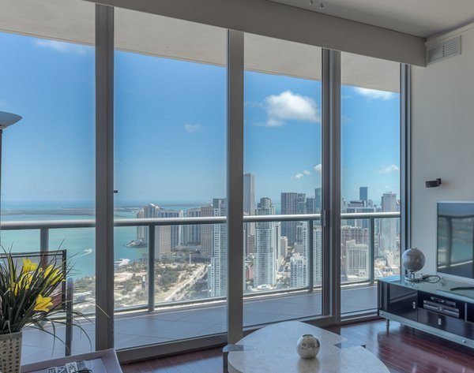
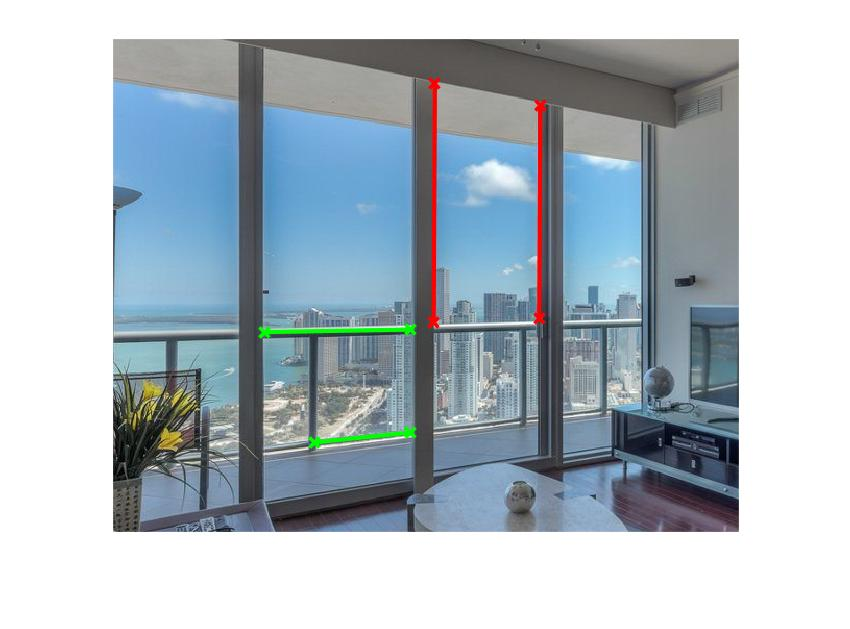
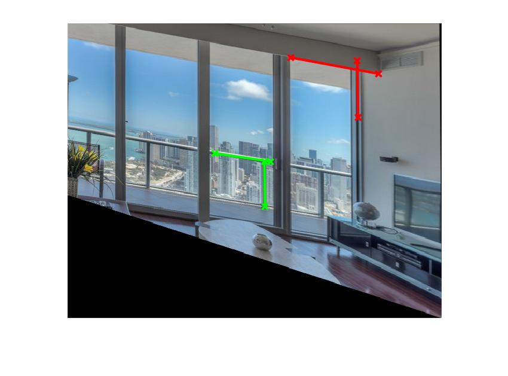
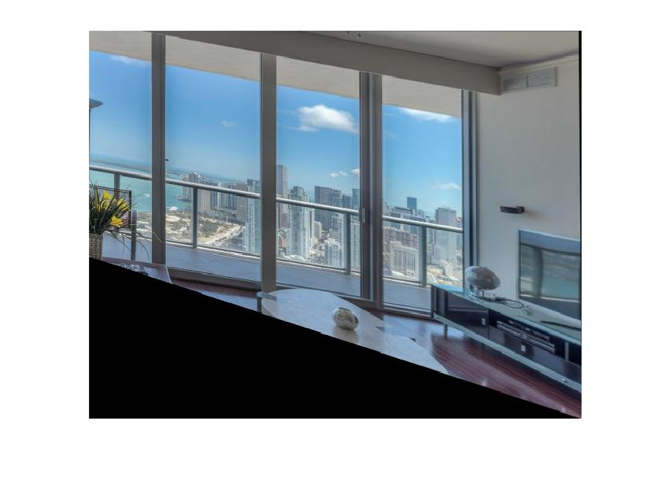
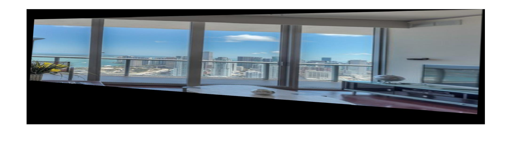

# Image Rectification Through Vanishing Elements

-----------------------

Original image

-----------------------

Parallel and orthogonal lines for affine and metric rectification

-----------------------

Affine rectification (preserves parallelism)

-----------------------

Metric rectification (preserves parallelism and orthogonality)

-----------------------